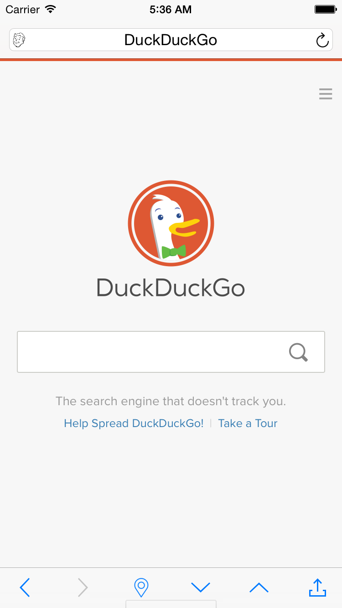

CruiserWebViewController 4.0
================
[](https://cocoadocs.org/docsets/CruiserWebViewController)
[](http://opensource.org/licenses/MIT)

iOS view controller component.  
Yet another one WebKit browser controller with enhanced navigation and additional controls.  
Designed to be integrated via storyboard.

Including:
- smart address bar
- 3 customizable top tab bar items
- navigation buttons on bottom bar



### Features

* Load HTTP links or local HTML.
* Navigation tools: backward/foward/anchor/down/up.
* Dragging gestures for back/forward, like Safari app.
* Progress bar embeded on the navigation bar or activity indicator (optional).
* Hide top and bottom bars when scrolling, like Safari app (optional).
* Contextual features: share link, copy link, read later.
* Customizable toolbar icons.

### Supports

* Portrait/Landscape
* Localization
* iPhone/iPad
* Retina & iPad6+ displays
* iOS8+ only
* Storyboard
* Autolayout
* ARC

## Installation

Available in [Cocoa Pods](http://cocoapods.org/?q=CruiserWebViewController)

```
pod 'CruiserWebViewController'
```

If you're importing the source files manually, you must add the `WebKit` framework to your project.

## How to use

Create UIViewController in Storyboard and set all IBOutlets.

## License

(The MIT License)

Based on [DZNWebViewController](https://www.cocoacontrols.com/controls/dznwebviewcontroller) by (c) 2014 Ignacio Romero Zurbuchen <iromero@dzen.cl>  
Copyright (c) 2015 Yuriy Pitomets <pitometsu@gmail.com>

Permission is hereby granted, free of charge, to any person obtaining a copy of this software and associated documentation files (the 'Software'), to deal in the Software without restriction, including without limitation the rights to use, copy, modify, merge, publish, distribute, sublicense, and/or sell copies of the Software, and to permit persons to whom the Software is furnished to do so, subject to the following conditions:

The above copyright notice and this permission notice shall be included in all copies or substantial portions of the Software.

THE SOFTWARE IS PROVIDED 'AS IS', WITHOUT WARRANTY OF ANY KIND, EXPRESS OR IMPLIED, INCLUDING BUT NOT LIMITED TO THE WARRANTIES OF MERCHANTABILITY, FITNESS FOR A PARTICULAR PURPOSE AND NONINFRINGEMENT. IN NO EVENT SHALL THE AUTHORS OR COPYRIGHT HOLDERS BE LIABLE FOR ANY CLAIM, DAMAGES OR OTHER LIABILITY, WHETHER IN AN ACTION OF CONTRACT, TORT OR OTHERWISE, ARISING FROM, OUT OF OR IN CONNECTION WITH THE SOFTWARE OR THE USE OR OTHER DEALINGS IN THE SOFTWARE.
